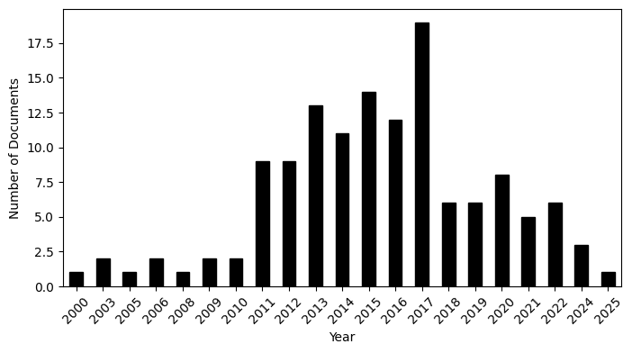
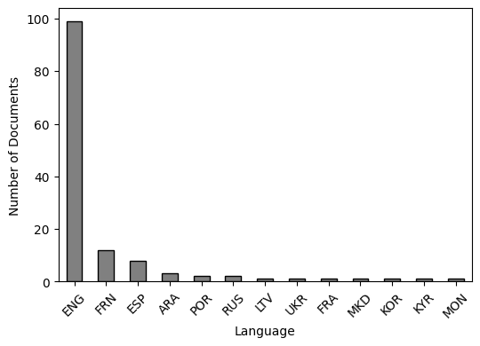

# Open Internet NLP (CMIST)

**Do national cybersecurity, ICT, and e-governance strategies describe an internet that is open — or one that is closed?**

This repository holds the data pipeline, models, and exploratory analysis for a research project that reads hundreds of national policy documents and uses NLP to measure where each country lands on the "open internet" vs. "closed/sovereign internet" spectrum. A companion strand of the project applies similar scraping and NLP tooling to track Ukrainian-language war coverage from archived news sites.

> 📌 This is an active research codebase (a collection of notebooks, scripts, and write-ups), not a packaged library. See [Project status](#project-status--things-to-know-before-you-dig-in) before you start.

---

## Table of contents

- [What this project does](#what-this-project-does)
- [The two research threads](#the-two-research-threads)
- [Repository structure](#repository-structure)
- [The corpus](#the-corpus)
- [Methodology / pipeline](#methodology--pipeline)
- [Preliminary findings](#preliminary-findings)
- [Getting started](#getting-started)
- [Reports & further reading](#reports--further-reading)
- [Project status / things to know before you dig in](#project-status--things-to-know-before-you-dig-in)
- [Author](#author)

---

## What this project does

Governments frame the internet very differently in their official strategies — some emphasize *openness, free flow of information, and multi-stakeholder governance*; others emphasize *sovereignty, control, and national security*. This project builds an NLP pipeline to detect and quantify that framing at scale, sentence by sentence, across a multilingual corpus of national cybersecurity, ICT, and e‑governance strategies.

The pipeline:

1. collects and OCRs/parses policy PDFs into clean text,
2. splits that text into sentence- and paragraph-level units,
3. identifies which sentences are actually about internet governance (as opposed to unrelated policy text),
4. classifies the relevant sentences as leaning **open**, **closed**, or **irrelevant/neutral**, using a mix of topic modeling, semantic similarity, and supervised classifiers, and
5. compares countries and country blocs (e.g. the **Five Eyes** vs. the **Shanghai Cooperation Organisation**) to see how their stances diverge.

## The two research threads

| Thread | Question | Core techniques |
|---|---|---|
| **A. Open vs. closed internet stance classification** | How do national cybersecurity/ICT/e‑governance strategies frame the internet, and how do countries/blocs compare? | PDF parsing & OCR, sentence tokenization, guided BERTopic, SBERT semantic similarity, TF‑IDF similarity, Random Forest / SVM / RoBERTa classification |
| **B. Ukrainian war-coverage media mapping** | What did Ukrainian outlets report on the front line and in policy analysis during the war, and how is that coverage distributed across sources? | Wayback Machine scraping, HTML parsing, Ukrainian→English machine translation |

Both threads share the same underlying toolkit (scraping → cleaning → embeddings/translation → analysis), which is why they live in one repo.

## Repository structure

```
Open_Internet_NLP_CMIST/
├── Data collection ────────────────────────────────────────────
│   ├── webscrapping.py                          # Scrapes archived Ukrainian news sites (Chayka, Vechirka) via requests/BeautifulSoup
│   ├── ukraine_war_coverage_webscrapping_sample.py  # Sample/variant of the above scraper with translation
│   └── Wayback_Machine_Scrapping_Latest.ipynb    # Full Wayback Machine pipeline: locates archived snapshots,
│                                                  #   extracts "policy analytics" & "on the frontline" articles,
│                                                  #   translates Ukrainian text to English
│
├── PDF parsing & text prep ────────────────────────────────────
│   ├── PDF_Parsing_Basics&OCR.ipynb              # Parsing-library comparisons + OCR worklist for hard-to-read PDFs
│   ├── PDF_Processing.ipynb                      # PDF/TXT → sentence-level CSV: Marker AI, BeautifulSoup, regex cleaning
│   ├── Sentence_Level_Analysis_Preparation.ipynb # Builds sentence-level, analysis-ready text files
│   ├── Paragraph_Level_Analysis_Preparation.ipynb# Builds paragraph-level text files
│   └── sequential_cybersecurities_strategies_processing.py  # Batch-runs Marker AI over the strategy PDF backlog
│
├── Topic modeling & similarity ────────────────────────────────
│   ├── Guided_Topic_Modeling.py                  # BERTopic seeded with "open" vs. "closed" internet vocabulary
│   ├── Bert_Topic_Modeling.ipynb                 # BERTopic experimentation notebook
│   ├── Passage_Ranking_By_Similarity.ipynb       # SBERT + cosine similarity to rank/label sentences by relevance
│   └── word_cloud_similarity_score_ipynb_v3.ipynb# TF-IDF vs. semantic-embedding similarity + word clouds by country
│
├── Classification ──────────────────────────────────────────────
│   └── Roberta_Transformer_Fine_Tune_Old.ipynb   # Fine-tunes a transformer classifier on hand-labeled sentences
│
├── Visualization ───────────────────────────────────────────────
│   ├── Ministry_of_Defense_Visualization.ipynb   # Timeline of strategy publication by country
│   ├── number_of_strategies_over_time.png        # Corpus coverage by year (2000–2025)
│   ├── language_distribution.png                 # Corpus coverage by source language
│   ├── TF-IDF Cosine Similarity.png               # Country-pair similarity heatmap (TF-IDF)
│   └── Semantic Embedding Cosine Similarity.png   # Country-pair similarity heatmap (SBERT embeddings)
│
└── Write-ups & datasets ────────────────────────────────────────
    ├── classification_model_quick_start_result_summary.pdf   # Training-set methodology + Random Forest/SVM results
    ├── open_internet_NLP_model_progress.pdf                   # Technical progress notes & model comparisons
    ├── TF-IDF vs Semantic Embedding Similarity Score Writeup.docx  # Interpreting the two similarity metrics
    └── ukr_news_sources_national_map.xlsx                     # Map of Ukrainian news sources by region
```

## The corpus

The core dataset behind Thread A is **205 national cyberdefense, ICT, and e-governance strategies from 110 countries**, published between 2000 and 2025, translated into English where necessary.

- **Coverage over time** — strategy publication picks up sharply after 2010 and peaks around 2017:

  

- **Source languages** — the corpus is predominantly English-language documents, with meaningful French, Spanish, and Arabic representation:

  

A hand-labeled training set was built by pulling ~5% of sentences from every strategy (**5,558 sentences**) and having **two human reviewers** independently code each one as **open (1)**, **closed (2)**, or **irrelevant (3)**. That labeled set underpins the supervised classifiers described below.

## Methodology / pipeline

```
Raw PDFs / archived web pages
        │
        ▼
 PDF parsing & OCR  ───────────────  Marker AI · pdfplumber · PyMuPDF (fitz)
        │
        ▼
 Sentence / paragraph segmentation ─ regex cleaning, tokenization
        │
        ▼
 Relevance detection ──────────────  SBERT embeddings + cosine similarity
        │                            against "open/closed internet" concept queries
        ▼
 Stance analysis ──────────────────  ┬─ Guided BERTopic (seeded open/closed keyword topics)
        │                            ├─ TF-IDF cosine similarity between countries
        │                            ├─ Semantic embedding cosine similarity between countries
        │                            └─ Supervised classification (Random Forest / SVM / RoBERTa)
        ▼
 Comparison & visualization ───────  country/bloc similarity heatmaps, word clouds,
                                     timeline of strategy publication
```

For Thread B, the pipeline swaps the first two stages for Wayback Machine discovery + HTML scraping + Ukrainian→English translation (`deep_translator` / `googletrans`), feeding into the same kind of text-cleaning and analysis utilities.

## Preliminary findings

From the TF-IDF vs. semantic-embedding comparison ([full write-up](<TF-IDF vs Semantic Embedding Similarity Score Writeup.docx>)):

- **TF-IDF cosine similarity** (surface-level vocabulary overlap) is lower on average and highlights pairs that literally share wording — e.g. India–Pakistan (0.77), USA–India (0.61), Belarus–Russia (0.52).
- **Semantic embedding cosine similarity** (meaning-level, via sentence transformers) runs higher overall and surfaces the same closely-linked pairs (India–Pakistan 0.71, Belarus–Russia 0.69) plus additional ones TF-IDF misses, like China–Pakistan (0.66).
- **Five Eyes countries** (USA, UK, Australia, Canada, New Zealand) tend to show more agreement with each other under both metrics, while **Shanghai Cooperation Organisation countries** (Russia, China, India, Pakistan, Belarus, Tajikistan) show more internal variation — China in particular shows high semantic similarity with many countries far more often than TF-IDF alone would suggest.

These are early-stage/preliminary results from an ongoing project — see the two PDF write-ups for full methodology, caveats, and worked examples.

## Getting started

This repo is a set of Jupyter notebooks and standalone scripts rather than an installable package, so there's no single `pip install`. To reproduce a given notebook:

1. **Clone the repo:**
   ```bash
   git clone https://github.com/JocelynWang0414/Open_Internet_NLP_CMIST.git
   cd Open_Internet_NLP_CMIST
   ```
2. **Install the libraries the notebook you want to run actually imports.** Across the project, the main dependencies are:
   ```bash
   pip install pandas numpy scikit-learn matplotlib seaborn plotly \
               sentence-transformers bertopic umap-learn hdbscan \
               transformers datasets torch \
               pdfplumber pymupdf python-docx wordcloud \
               beautifulsoup4 selectolax selenium webdriver-manager helium \
               deep-translator googletrans==4.0.0-rc1 requests
   ```
   Some notebooks additionally call the [Marker](https://github.com/VikParuchuri/marker) CLI (`marker_single`) for difficult PDF-to-markdown conversion — install it separately if you need that step.
3. **Open notebooks in a rough pipeline order** (data collection → PDF parsing → sentence/paragraph prep → topic modeling / similarity → classification → visualization) — see [Repository structure](#repository-structure) above for what each notebook does.

## Reports & further reading

- 📄 [`open_internet_NLP_model_progress.pdf`](open_internet_NLP_model_progress.pdf) — technical progress notes comparing embedding models, classifiers, and keyword-based approaches, with worked failure cases.
- 📄 [`classification_model_quick_start_result_summary.pdf`](classification_model_quick_start_result_summary.pdf) — the human-labeling methodology and Random Forest / SVM classification results.
- 📄 [`TF-IDF vs Semantic Embedding Similarity Score Writeup.docx`](<TF-IDF vs Semantic Embedding Similarity Score Writeup.docx>) — how to interpret the two similarity metrics used to compare countries.

## Project status / things to know before you dig in

This is a working research repo, so a few things to expect:

- **Notebooks are exploratory**, not production pipelines — many contain commented-out experiments, hard-coded local file paths (e.g. `./sequential_strategies_pdf`, `./marker_done_seq`), and Google Colab–specific cells (`from google.colab import drive`).
- **Raw source PDFs and scraped datasets are not included** in the repo (only derived outputs like CSVs referenced in code, and the summary spreadsheet/images) — you'll need to supply your own copies of the national strategy documents to fully reproduce the pipeline.
- Some scripts (e.g. `sequential_cybersecurities_strategies_processing.py`) are one-off batch-processing jobs written against a specific local folder layout rather than general-purpose utilities.
- Findings throughout are **preliminary** and under active revision — treat the write-ups as research notes, not final conclusions.

## Author

Maintained by **Jocelyn Wang** ([@JocelynWang0414](https://github.com/JocelynWang0414)).
